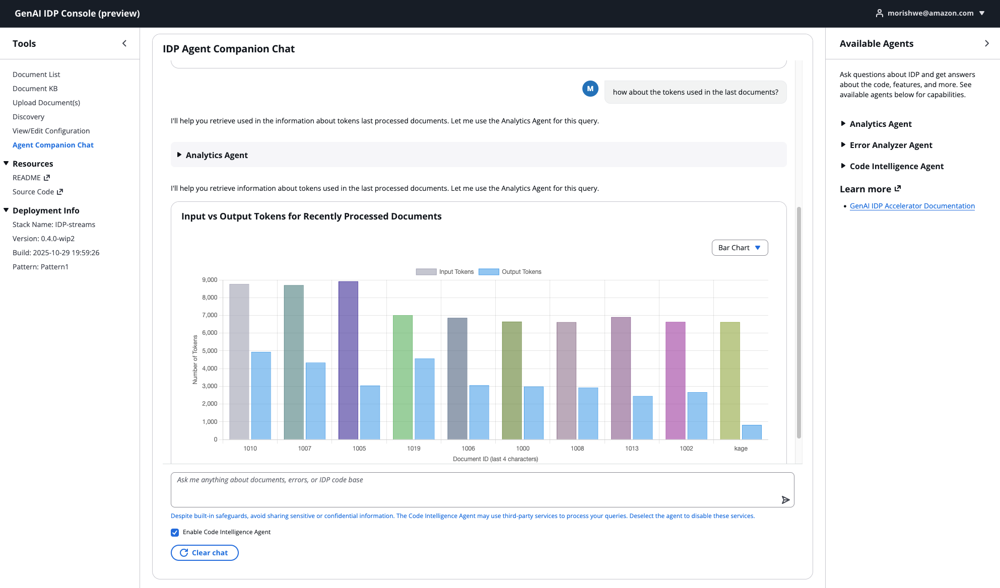
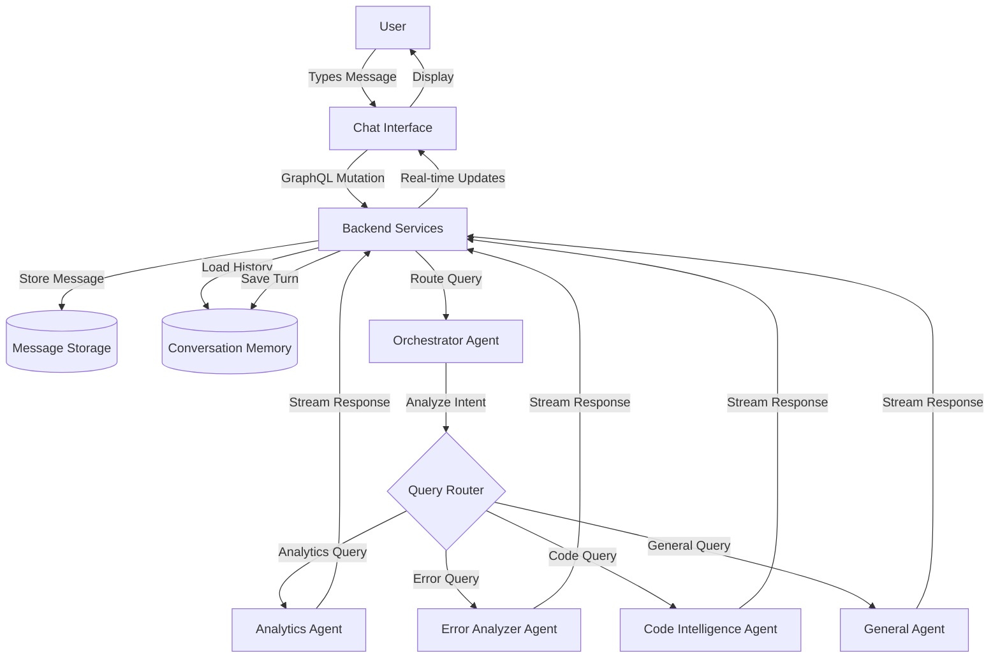
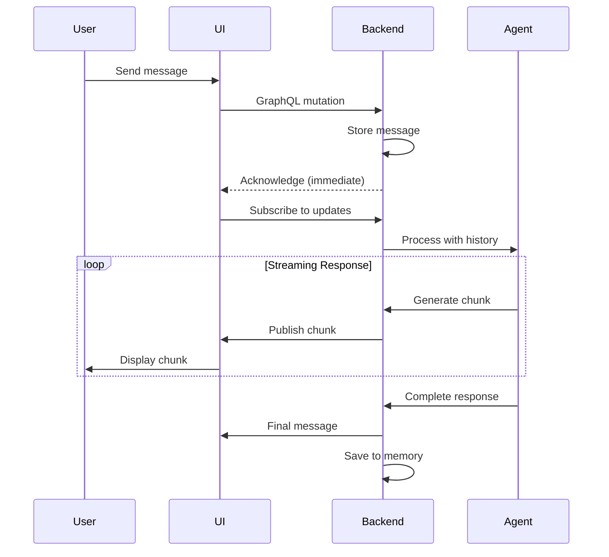
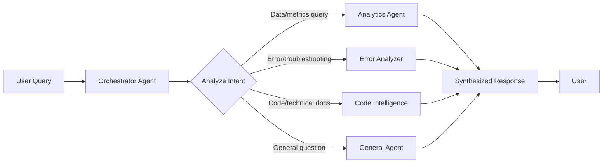

# Agent Companion Chat



## Overview

The Agent Companion Chat is an interactive AI assistant that provides a conversational experience for the GenAI IDP Accelerator. Unlike the document-specific troubleshooting tool, the companion chat offers persistent, multi-turn conversations with specialized agents that can help with analytics, code assistance, error diagnosis, and general questions about the system.

https://github.com/user-attachments/assets/c48b9e48-e0d4-457c-8c95-8cdb7a9d332b

### Key Features

- **Multi-Turn Conversations**: Have natural back-and-forth conversations with context awareness
- **Specialized Agents**: Access multiple AI agents optimized for different tasks
- **Real-Time Streaming**: See responses appear progressively as the agent thinks
- **Visual Data**: Automatic charts, tables, and formatted data visualization
- **Transparent Tool Usage**: See when agents use tools and call sub-agents
- **Session Persistence**: Your conversations are saved and resume where you left off
- **Sample Prompts**: Get started quickly with suggested queries
- **Privacy Controls**: Optional Code Intelligence with user consent for external services

### When to Use Agent Companion Chat

**Use the Companion Chat for:**
- Asking questions about the IDP system and how it works
- Getting help with configuration and best practices
- Analyzing system-wide trends and metrics
- Learning about features and capabilities
- Troubleshooting issues across multiple documents
- Getting code examples and technical guidance

**Use Document Troubleshooting (in Document Panel) for:**
- Investigating a specific failed document
- Quick diagnosis of individual document errors
- One-time error analysis without conversation history

## Security and Privacy

### Code Intelligence and Third-Party Services

**⚠️ IMPORTANT: Read Before Using Code Intelligence**

The Agent Companion Chat includes an optional Code Intelligence Agent that can provide enhanced code assistance and technical documentation. However, this agent uses third-party MCP (Model Context Protocol) servers, which means your queries may be sent to external services.

**What This Means**:
- When Code Intelligence is **enabled**, queries routed to this agent may be sent to external services (DeepWiki MCP server)
- These external services are **not controlled by AWS** or your organization
- Data sent to these services is subject to their privacy policies and terms of service

**Security Best Practices**:

✅ **Safe to Discuss**:
- General IDP features and capabilities
- Public documentation and configuration examples
- Generic code patterns and best practices
- Non-sensitive technical questions
- Publicly available information

❌ **DO NOT Share**:
- Customer names, email addresses, or personal information
- AWS account IDs, API keys, credentials, or secrets
- Proprietary business logic or confidential data
- Internal system details or security configurations
- Actual document content or extracted data
- Customer-specific information or use cases
- Private network configurations or IP addresses

**Built-in Protections**:
- System prompts are configured to prevent the agent from sending sensitive data
- The agent is instructed to refuse requests involving credentials or personal information
- User-controlled toggle allows you to disable the feature entirely

**Recommendations**:
1. **Review your questions** before sending to ensure they contain no sensitive information
2. **Use other agents** (Analytics, Error Analyzer, General) for queries involving your actual system data
3. **Enable only when needed** for generic code help, then disable it again

### Data Storage and Retention

**Conversation History**:
- All conversations are stored in DynamoDB within your AWS account
- Conversation history is retained for the duration of your session
- Data remains within your AWS environment and is subject to your AWS security policies
- No conversation data is sent to external services except when Code Intelligence is enabled and invoked

**Session Isolation**:
- Each conversation has a unique session ID
- Sessions are isolated from each other
- Clearing chat creates a new session
- Previous session data is not accessible from new sessions

## Architecture Overview

### System Design

The Agent Companion Chat uses a session-based architecture that differs fundamentally from the job-based document troubleshooting system:



### Key Architectural Components

**1. Session-Based Conversations**

Unlike the job-based troubleshooting system (one request → one response), the companion chat maintains persistent sessions:

| Component | Document Troubleshooting | Agent Companion Chat |
|-----------|-------------------------|---------------------|
| **Interaction Model** | Single-shot analysis | Multi-turn conversation |
| **Context** | Document-specific | Session-based with history |
| **Memory** | Stateless | Persistent (last 20 turns) |
| **Agents** | Error Analyzer only | Multiple specialized agents |
| **Lambda Functions** | `agent_processor`, `agent_request_handler` | `agent_chat_processor`, `agent_chat_resolver` |
| **Storage** | Job results only | Full conversation history |

**2. Conversation Memory System**

The chat maintains conversation history in DynamoDB:
- **Automatic Loading**: Last 20 conversation turns loaded on each request
- **Context Management**: Sliding window keeps conversations within token limits
- **Turn Grouping**: Each turn contains one user message and one assistant response
- **Smart Optimization**: Drops verbose tool results while preserving user-visible content

**3. Real-Time Streaming**

Messages stream in real-time using AWS AppSync GraphQL subscriptions:



**Benefits of Streaming**:
- Users see responses immediately as they're generated
- No waiting for complete response before seeing anything
- Transparent view of agent thinking process
- Better user experience for long responses

**4. Intelligent Agent Orchestration**

The orchestrator agent acts as a smart router:



**Orchestrator Capabilities**:
- Analyzes query intent to select the right specialist
- Can coordinate multiple agents for complex queries
- Prevents redundant calls to the same agent
- Streams sub-agent execution in real-time
- Detects and visualizes structured data

**5. Sub-Agent Streaming**

When the orchestrator calls a specialized agent, you see the execution in real-time:

```
🔧 Calling: Error Analyzer Agent
   ↓
   [Streaming output...]
   "Searching CloudWatch logs for validation errors..."
   "Found 8 matching errors in the last hour..."
   "Analyzing error patterns..."
   ↓
   ✓ Complete: Analysis finished
```

This transparency helps you understand:
- Which tools the agent is using
- What data it's accessing
- How it's reasoning about your query
- Why it reached its conclusions

### Data Flow

**Message Lifecycle**:

1. **User Input** → Message typed in chat interface
2. **Storage** → Message stored in ChatMessagesTable with session ID
3. **History Loading** → Last 20 turns loaded from ChatMemoryTable
4. **Agent Processing** → Orchestrator routes to appropriate specialist
5. **Streaming** → Response chunks published via AppSync subscription
6. **Display** → UI renders chunks progressively
7. **Memory Save** → Complete turn saved to ChatMemoryTable
8. **Final Storage** → Complete response stored in ChatMessagesTable

**Session Management**:
- Each conversation has a unique session ID (UUID v4)
- Sessions isolate conversations from each other
- Conversation history persists within a session
- Clearing chat creates a new session ID

## Getting Started

### Accessing the Chat

1. Navigate to the **Agent Chat** section in the Web UI navigation
2. The chat interface opens with a welcome message and sample prompts
3. Start typing your question or click a sample prompt to begin

### Your First Conversation

The chat interface provides sample prompts to help you get started:

**Analytics Questions**:
- "How many documents were processed today?"
- "Show me the success rate for the last week"
- "What are the most common document types?"

**Error Analysis**:
- "Show me recent processing errors"
- "What validation errors occurred today?"
- "Why did document lending_package.pdf fail?"

**System Help**:
- "How does the classification stage work?"
- "What models are supported for extraction?"
- "Explain the assessment process"

**Code Assistance** (if Code Intelligence is enabled):
- "How do I implement a custom extraction prompt?"
- "Show me an example of custom validation logic"
- "What's the best way to handle multi-page documents?"


## Core Features

### Multi-Turn Conversations with Memory

The companion chat remembers your conversation history, enabling natural follow-up questions:

**Example Conversation**:
```
You: "How many documents failed today?"
Agent: "I found 15 failed documents today. The most common error was 
       ValidationException affecting 8 documents..."

You: "What caused those validation errors?"
Agent: "Based on the 8 validation errors I mentioned, the primary cause 
       was malformed JSON in extraction prompts..."

You: "How can I fix that?"
Agent: "To fix the validation errors, you should update your extraction 
       configuration..."
```

The agent maintains context throughout the conversation, so you don't need to repeat information.

### Real-Time Streaming Responses

Watch responses appear progressively as the agent generates them:

- **Live Text**: See the response being written word-by-word
- **Streaming Indicators**: Visual feedback shows when the agent is actively thinking
- **Sub-Agent Visibility**: Expandable sections show when specialized agents are called
- **Structured Data**: Charts and tables render automatically when detected

### Intelligent Agent Routing

The orchestrator automatically routes your query to the right specialist:

**How It Works**:
1. You ask a question
2. The orchestrator analyzes your query
3. It routes to the appropriate specialized agent (Analytics, Error Analyzer, Code Intelligence, or General)
4. You see which agent is being used in real-time
5. The agent responds with specialized knowledge

**Multi-Agent Coordination**:
For complex queries, the orchestrator can consult multiple agents:

```
You: "Show me today's failed documents and explain the most common error"

Agent: [Calls Analytics Agent] → Retrieves failed document list
       [Calls Error Analyzer] → Analyzes error patterns
       [Synthesizes Response] → Provides comprehensive answer
```


### Structured Data Visualization

The chat automatically detects and visualizes structured data in responses:

**📊 Charts and Plots**:
When the agent provides data suitable for visualization, it automatically renders as an interactive chart:

```
You: "Show me document processing trends for the last 7 days"

Agent: [Displays line chart showing daily processing volumes]
       "Here's the processing trend over the last week. You can see 
       a spike on Tuesday with 245 documents..."
```

**📋 Tables**:
Tabular data is rendered with sorting and filtering capabilities:

```
You: "List the failed documents from today"

Agent: [Displays sortable table]
       | Document Name | Error Type | Timestamp |
       |---------------|------------|-----------|
       | contract.pdf  | Validation | 14:23:45  |
       | form_123.pdf  | Timeout    | 15:30:12  |
```

**📝 Formatted Code**:
Code examples include syntax highlighting:

```
You: "Show me an example extraction prompt"

Agent: [Displays formatted JSON with syntax highlighting]
       {
         "extraction": {
           "model": "anthropic.claude-3-sonnet-20240229-v1:0",
           "attributes": [...]
         }
       }
```

### Tool Usage Transparency

See exactly what the agent is doing behind the scenes:

**Expandable Tool Sections**:
- Click to expand and see tool execution details
- View inputs sent to tools
- See outputs returned from tools
- Understand the agent's reasoning process

**Sub-Agent Calls**:
When the orchestrator calls a specialized agent, you see:
- Which sub-agent is being invoked
- Real-time streaming output from the sub-agent
- Final results from the sub-agent
- Any errors encountered

**Example**:
```
🔧 Using Tool: Error Analyzer
   Input: "Analyze recent validation errors"
   
   [Streaming output from Error Analyzer...]
   "Searching CloudWatch logs..."
   "Found 8 validation errors..."
   "Analyzing error patterns..."
   
   ✓ Complete: Root cause identified
```


## Available Agents

### Analytics Agent

**Best For**: Data analysis, metrics, and reporting queries

**What It Can Do**:
- Query document processing statistics
- Generate reports on system performance
- Analyze processing trends and patterns
- Provide insights on document types and volumes
- Calculate success rates and processing times

**Example Questions**:
```
"How many documents were processed today?"
"Show me the success rate for the last week"
"What are the most common document types?"
"Generate a report on processing times"
"Which documents took the longest to process?"
"What's the average processing time by document type?"
```

### Error Analyzer Agent

**Best For**: Troubleshooting and error diagnosis

**What It Can Do**:
- Diagnose specific document failures
- Analyze system-wide error patterns
- Investigate CloudWatch logs
- Identify root causes with evidence
- Provide actionable recommendations

**Example Questions**:
```
"Why did document lending_package.pdf fail?"
"Show me recent processing errors"
"What validation errors occurred today?"
"Analyze timeout issues in the last hour"
"What's causing the most failures this week?"
"Find errors related to Bedrock throttling"
```

**Conversation Context Advantage**:
Unlike the document troubleshooting modal, the chat version allows follow-up questions:

```
You: "Why did contract.pdf fail?"
Agent: "The document failed due to a ValidationException..."

You: "Has this happened to other documents?"
Agent: "Yes, I found 5 other documents with the same error pattern..."

You: "How do I prevent this?"
Agent: "To prevent this validation error, update your configuration..."
```


### Code Intelligence Agent

**Best For**: Code-related assistance and technical documentation

**What It Can Do**:
- Explain code concepts and examples
- Look up technical documentation via DeepWiki
- Provide programming language assistance
- Show API and library documentation
- Recommend best practices and design patterns

**Example Questions**:
```
"How do I implement a custom extraction prompt?"
"Explain the assessment configuration options"
"What's the best way to handle multi-page documents?"
"Show me an example of custom validation logic"
"How do I use the post-processing Lambda hook?"
"What are the available configuration parameters?"
```

**⚠️ Privacy and Security - IMPORTANT**:

The Code Intelligence Agent uses a third-party MCP (Model Context Protocol) server (DeepWiki) to provide enhanced technical documentation and code assistance. This means some of your queries may be sent to external services.

**Security Considerations**:
- **External Service**: Uses DeepWiki MCP server for documentation lookup
- **Data Transmission**: When enabled, your queries may be sent to third-party services
- **Built-in Protections**: System prompts are configured to prevent sending sensitive data externally
- **User Control**: You must explicitly enable this feature via the toggle

**⚠️ DO NOT share sensitive information when Code Intelligence is enabled:**
- Customer names, email addresses, or personal information
- AWS account IDs, API keys, or credentials
- Proprietary business logic or confidential data
- Internal system details or security configurations
- Actual document content or extracted data

**Safe to Share**:
- General questions about IDP features and capabilities
- Public documentation and configuration examples
- Generic code patterns and best practices
- Non-sensitive technical questions

**Enabling/Disabling**:
1. Look for the "Code Intelligence" toggle in the chat interface
2. Click to enable or disable
3. When disabled, the orchestrator won't route queries to this agent
4. Your preference is saved for the session
5. **Recommendation**: Keep disabled unless you specifically need code assistance and are certain your queries contain no sensitive information

### General Agent

**Best For**: General questions about the IDP system

**What It Can Do**:
- Explain system architecture and features
- Provide configuration guidance
- Answer questions about capabilities
- Recommend best practices
- Offer general troubleshooting advice

**Example Questions**:
```
"What is the GenAI IDP Accelerator?"
"How does the classification stage work?"
"What models are supported for extraction?"
"Explain the assessment process"
"What's the difference between OCR and native text extraction?"
"How do I configure multi-language support?"
```


## Using the Chat Interface

### Chat Controls

**Message Input**:
- Type your question in the text box at the bottom
- Press Enter or click Send to submit
- Multi-line input supported (Shift+Enter for new line)

**Sample Prompts**:
- Click any sample prompt to insert it into the input box
- Prompts are contextual based on available agents
- Edit the prompt before sending if needed

**Clear Chat**:
- Click the "Clear Chat" button to start a new conversation
- This creates a new session and clears conversation history
- Previous conversations are saved but not accessible in the current session

**Code Intelligence Toggle**:
- Located near the top of the chat interface
- Shows current status (enabled/disabled)
- Click to toggle on or off
- Changes take effect immediately for new messages

### Understanding Responses

**Message Types**:

1. **Text Responses**: Standard conversational answers with Markdown formatting
2. **Structured Data**: Automatically rendered charts, tables, or formatted code
3. **Tool Usage**: Expandable sections showing agent tool executions
4. **Error Messages**: Clear error notifications if something goes wrong

**Visual Indicators**:

- **Streaming Dots**: Agent is actively generating a response
- **Loading Bar**: Processing your request
- **Tool Icon**: Agent is using a tool or calling a sub-agent
- **Checkmark**: Response completed successfully
- **Error Icon**: Something went wrong

### Best Practices

**Asking Effective Questions**:

✅ **Good Questions**:
```
"Show me documents that failed with validation errors today"
"How do I configure the extraction model?"
"What's the average processing time for invoices?"
```

❌ **Less Effective**:
```
"Help" (too vague)
"Errors" (not specific enough)
"Fix it" (no context)
```

**Using Follow-Up Questions**:

Take advantage of conversation memory:
```
You: "How many documents failed today?"
Agent: "15 documents failed today..."

You: "Show me the first 5"  ← Agent remembers context
Agent: "Here are the first 5 failed documents..."

You: "What caused the first one?"  ← Still in context
Agent: "The first document failed because..."
```

**When to Start a New Conversation**:

Start a new chat session when:
- Switching to a completely different topic
- The conversation becomes too long or unfocused
- You want to test the same query without prior context
- You've resolved an issue and want a fresh start


## Common Use Cases

### Investigating System Health

**Scenario**: You want to check if the system is processing documents correctly

```
You: "How many documents were processed in the last hour?"
Agent: "In the last hour, 47 documents were processed with a 94% success rate..."

You: "What about the failures?"
Agent: "There were 3 failures: 2 validation errors and 1 timeout..."

You: "Show me details on the timeout"
Agent: "The timeout occurred for document large_contract.pdf..."
```

### Troubleshooting Recurring Errors

**Scenario**: Multiple documents are failing with similar errors

```
You: "Show me validation errors from today"
Agent: [Displays table of 8 validation errors]

You: "What do these have in common?"
Agent: "All 8 errors involve malformed JSON in extraction prompts..."

You: "How do I fix this?"
Agent: "Update your extraction configuration to escape special characters..."
```

### Learning About Features

**Scenario**: You want to understand how a feature works

```
You: "How does the assessment stage work?"
Agent: "The assessment stage validates extracted data against criteria..."

You: "Can you show me an example configuration?"
Agent: [Displays formatted JSON configuration with explanations]

You: "What models can I use for assessment?"
Agent: "You can use any of these Bedrock models for assessment..."
```

### Analyzing Performance Trends

**Scenario**: You want to understand processing patterns

```
You: "Show me processing trends for the last week"
Agent: [Displays line chart of daily volumes]

You: "Why was Tuesday so high?"
Agent: "Tuesday had 245 documents, which is 3x the daily average..."

You: "What types of documents were processed on Tuesday?"
Agent: [Displays pie chart of document types]
```

### Getting Code Examples

**Scenario**: You need help implementing a custom feature (Code Intelligence enabled)

```
You: "How do I implement a custom extraction prompt?"
Agent: "Here's an example of a custom extraction prompt..."
       [Displays code with syntax highlighting]

You: "How do I add validation to this?"
Agent: "You can add validation by including criteria in your config..."
       [Shows updated code example]
```


## Troubleshooting

### Agent Not Responding

**Symptoms**: Message sent but no response appears

**Possible Causes**:
- Network connectivity issue
- Backend service temporarily unavailable
- Session expired

**Solutions**:
1. Check your internet connection
2. Refresh the page and try again
3. Clear chat and start a new session
4. Check AWS service health dashboard

### Incomplete or Cut-Off Responses

**Symptoms**: Response stops mid-sentence or seems incomplete

**Possible Causes**:
- Token limit reached
- Timeout during processing
- Network interruption

**Solutions**:
1. Ask the agent to continue: "Please continue"
2. Rephrase your question to be more specific
3. Break complex questions into smaller parts
4. Start a new session if conversation is very long

### Code Intelligence Not Available

**Symptoms**: Code Intelligence toggle is disabled or queries aren't routed to it

**Possible Causes**:
- Feature not enabled in deployment
- MCP server not configured
- Toggle manually disabled

**Solutions**:
1. Check if the toggle is enabled in the chat interface
2. Verify Code Intelligence is configured in your deployment
3. Contact your administrator if the feature should be available

### Structured Data Not Rendering

**Symptoms**: Charts or tables appear as raw JSON instead of visualizations

**Possible Causes**:
- Data format not recognized
- Browser compatibility issue
- Rendering error

**Solutions**:
1. Refresh the page
2. Try a different browser
3. Ask the agent to reformat the data
4. Check browser console for errors

